# Just Keep Spinning

Just Keep Spinning is a website promoting a Dublin based spin studio. This website is aimed at anyone that is over the age of 16 and is keen to keep fit improve their cardio fitness while having some fun. Just keep spinning offers a variety of membership options, one to suit everybody which potential members can view on the website. Potential members will have the opportunity to sign up for a free trial on the website, selecting a day & time that suits them best. Potential members will be able to view the timetable to make sure there is a class available at a time that suits them best.

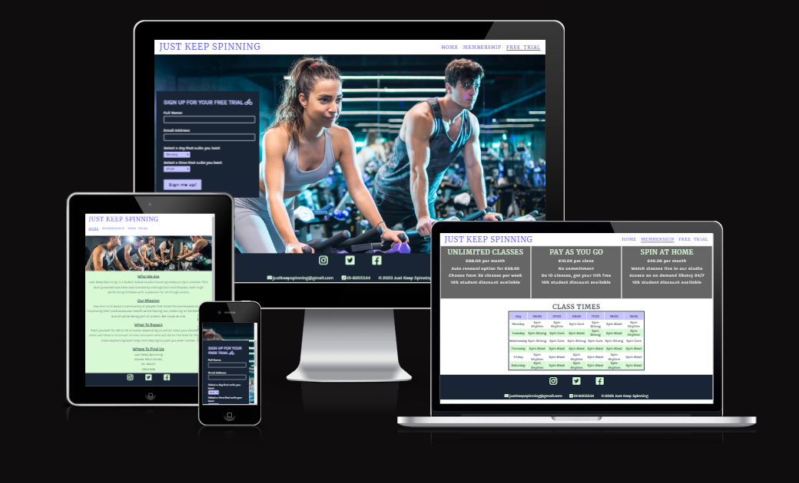

Link to published site: https://lornavav.github.io/just-keep-spinning/

### Site Goals

The goal of Just Keep Spinning is to inform potential members (users) of what we have to offer. We want users to be able to visit the site and find all the information they need. We want users to be able to find information quickly, so we have chosen a simple design and kept content to a minimum. We have kept the structure of each of the 3 pages the same with uniformed nav bar and footer and image placement so that each page looks familiar to the user.

### User Stories

As a user:
    
* I want to see 3 pages on the website
* I want to see a hero image on the homepage
* I want to see the following 3 headings on the homepage with a paragraph of  text underneath each one
    * Who we are
        * Just Keep Spinning is a Dublin based studio focusing solely on spin classes. This family-owned business was started by siblings Carl and Claudia, both high preforming athletes with a passion for all things cardio.

    * Our Mission
        * Our aim is to build a community of people that share the same passion for improving their cardiovascular health while having fun, listening to the best music, and all while being part of a team all. We move as one.

    * What to Expect
        * Push yourself for 30 to 45 minutes depending on which class you choose. Each class will have a minimum of one instructor who will be on the bike for the whole class explaining each step and helping to push you even further.

* I want to see a footer which remains in place for each of the 3 pages
* I want to see a copyright message in the footer
* I want to see Instagram, Twitter and Facebook icons in the footer
    * When each icon is clicked I should be directed to the respective website
    * The website should open in a new browser tab
* I want to see the 3 types of membership options on the Membership page
* I want to see the class timetable underneath the membership prices on the membership page
* I want to see a sign up form on the Free Trial page
    * The form heading should read 'SIGN UP FOR YOUR FREE TRIAL TODAY'
    * The form will include an input field for Full Name & Email Address
        *These will be required fields
    * The form will have a text instruction of 'Select a day that suits you best' with a select drop down list
        * The drop down list should contain the following options
            * Monday
            * Wednesday
            * Friday
        * This is a required field
    * The form should have a text instruction of 'Select a time that suits you best' with a select drop down list
        * The drop down list should contain the following options
            * 7:30
            * 9:00
            * 18:00
        * This is a required field
    * The form will have a 'Sign me up!' submit button
    * The form will be submitted once each of the required fields has been filled out
    * A confirmation message should appear on the screen if the form has been successfully submitted
    * In the footer I want  an email icon with email address  justkeepspinning@gmail.com
    * This should contain a telephone icon with phone number 01-8205544

## UX
* Strategy
    * This website was designed and targeted towards people with a keen interest in cardio activity. There is a gap in the market in Dublin for a fitness studio that focuses solely on spinning classes. The target audience are busy professionals, or busy parents. They want to get in and get their workout done as quick as possible. We wanted this to be reflected on the website. Keep the content simplistic. Our target audience want the key information as quick as possible.

* Scope
    * The initial scope of this website is to provide the target audience with all the information they need to join our spin studio. We will provide information on pricing, class times, some brief information about us and what we are about. We will have contact details and links to our socials. We will provide a form where potential members can sign up for a free trial.

* Structure
    * We will go live with a basic structure. There will be 3 pages of the website. Each page will share the same header which will contain a logo and a navigation bar. Each page will share the same footer which will contain the social media links, contact details and a copyright notice. The home page will contain four inline blocks containing some introduction text. The membership page will have a similar layout to the home page and contain three inline blocks which will contain the membership prices. The user will find each page consistent with the next.

* Skeleton
    * By splitting the content over 3 pages, it gives the content room to breathe and helps the user to clearly see the information they need. We will invite the user to browse through the website for the key information, such as pricing and class times which the user will need to navigate to the 2nd page to find. We want the user to stay on the website as long as possible while still making it very easy to find the information that they need as quick as possible.

* Surface
    * We will stick to a very minimal colour palette for the website comprising of 4 main colours. We will use variations of these across the 3 pages to provide consistency and familiarity to the user. We will use just two fonts, one for headers and one for the body. The colours will provide a nice colour contrast which will make the content stand out to the user.

### Wireframes

See inital wireframe which were created using [Excalidraw](https://excalidraw.com/) 

See updated version for page 2 after i decided it was best to include a timetable of classes rather than the FAQ section.

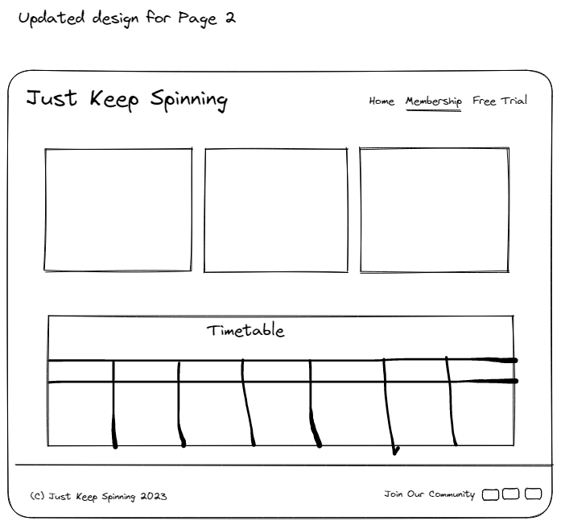

See updated version for page 3 after I decided to include a Where to find us section

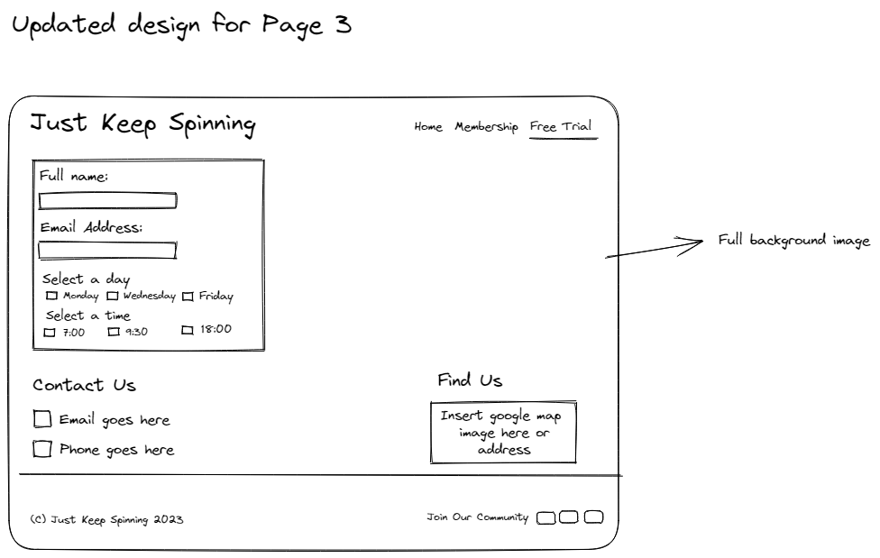

### Design Choices

*   For design I had a look around some websites that I know have a nice interface and are easy to navigate. I took a fancy to [Pipedrive](https://www.pipedrive.com/) and their colour scheme so I borrowed their hex values.

* For the font I took a [fontpair](https://www.fontpair.co/all) and they had some styles paired and I liked the look of Karla & Merriweather.

## Features 

### Existing Features

* Navigation Bar

    * The navigation bar features on all three pages, it includes a logo which links back to the home page when clicks. There are then three links one for the home page, the membership page and the free trial page.
    

    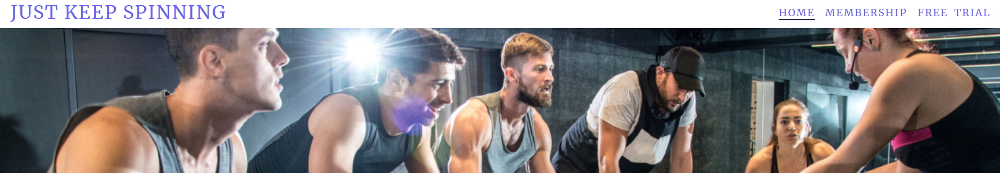

* Hero Image

    * The hero image is a high quality image that responds well on all devices. There is an alt attribute attached for screen readers.

    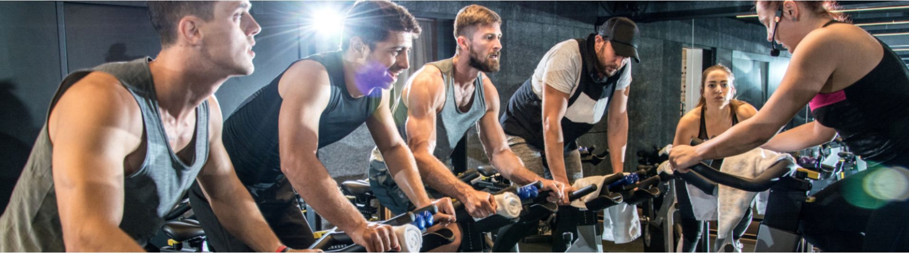

* Who We Are, Our Mission, What to Expect & Where to find us

    * This section provides a brief overview of our mission, what our members can expect from a class. We provde details on where we are located and a small bit about the founders.

    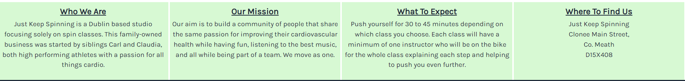

* The Footer

    *   The footer is a fixed footer which appears on all 3 pages. It contains links to social channels. When a social media icon is clicked it will launch the website in a new tab It also contains contact information and a copyright notice.

    

* Membership Prices 

    * This sectin provides potential members with the three pricing options available to them. We created a div for each membership option and placed a nice background image across the three divs. This idea was taken from the times section of the Love Running module.

    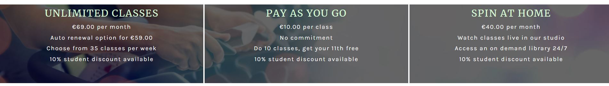

* Class Times 

    * They table provides potential members with all the class types and times on offer. 

    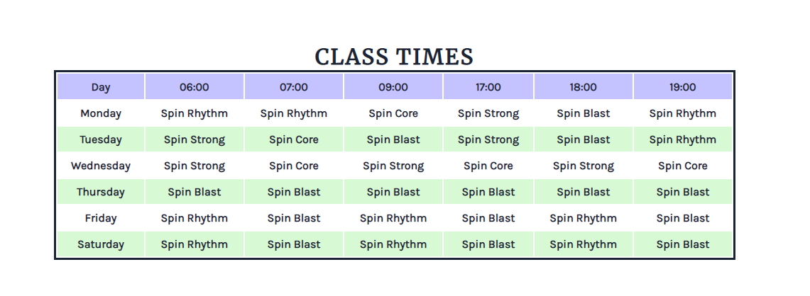

* Free Trial sign up form

    *   This forms allows potential members to sign up for a free trail by entering their name and email address and selecting a day and time thats suits them best by using a select box.

    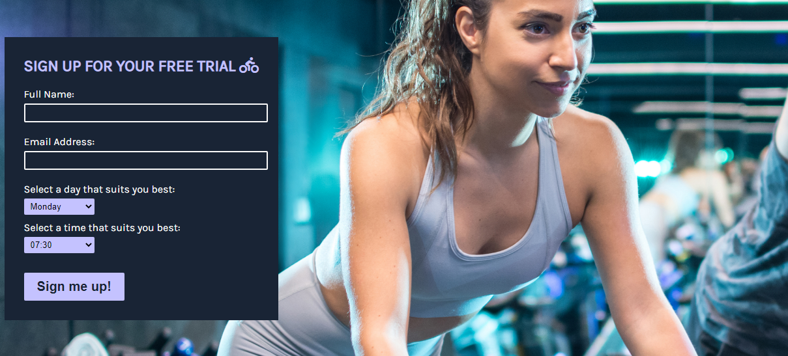

### Future Features

* An online booking system for members
* The option for members to purchase memberships on the website
* An embeded google map
* Videos of spin classes from the studio

### Testing

## Validator Testing
*   No HTML errors were found when validating through [W3C HTML Validator](https://validator.w3.org/#validate_by_uri)

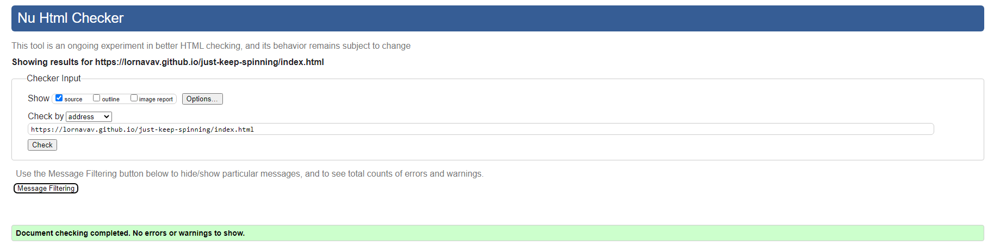
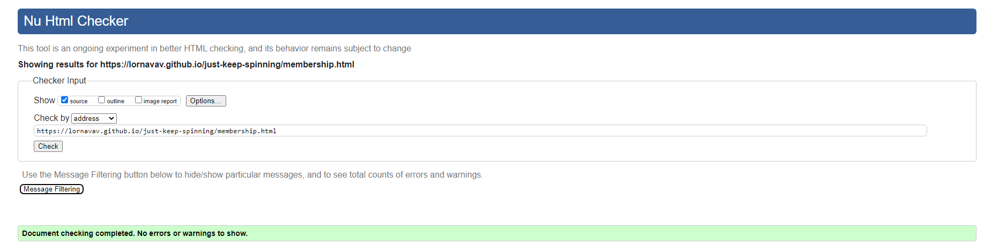
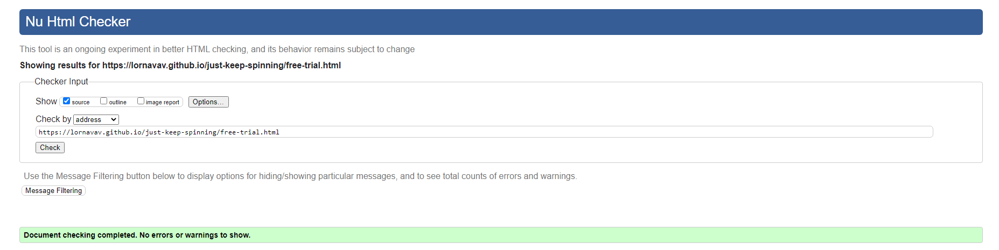

* No CSS errors were found when passing validating through [W3C CSS Validator (Jigsaw)](https://jigsaw.w3.org/css-validator/)

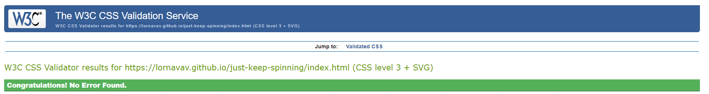
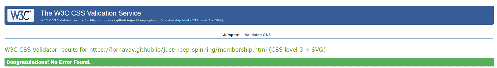
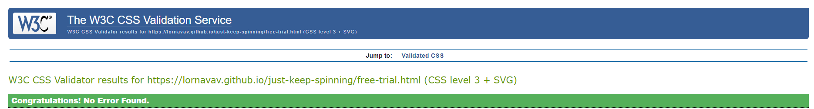

* A high score was obtained through the lighthouse report from dev tools, showing that the website has good accessibility and contrast

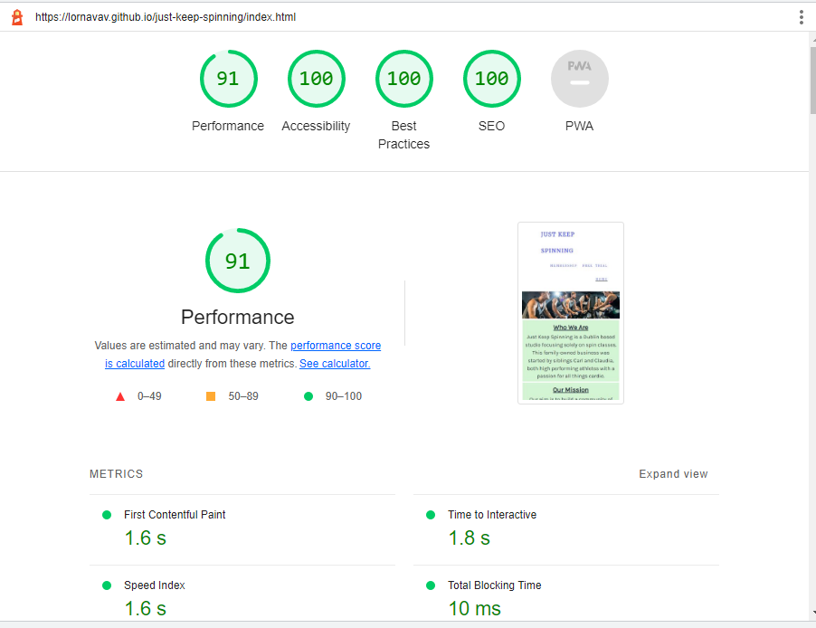

## Bugs
* I encountered some bugs along the way, I changed design scope and removed any code that wasn't working or I couldnt solve.
    * I wanted to add more text to the footer with social media icons which red 'Join our community' but I couldnt get it to postion correctly or be responsive.
    * I initally used check boxes on my form for choosing the sate and time but the user was able to check all options and I couldnt figure out how to stop this.
    * I then used radio buttons in my form and again the user was able to check all options this was because I forgot to add the name attribute to each option. I then couldnt style the label and buttons nicely so I ended up using the select box which looked better.

* There are no known unfixed bugs.

### Deployment

* To deploy the webiste I followed the following steps
    * I logged into [GitHub](https://github.com/)
    * From my repository I selected 

### Credits

## Content
    
* Website and concept ideas taken from [Spin and Go](https://spinandgo.ie/)
* Colour scheme taken from [Pipedrive](https://www.pipedrive.com/) 
* Code for social media footer icons and aria labels taken from the CI Kove Running module
* Referenced the Love Running sign up form challeneg for styling on the free trial form
* Referenced [W3 Schools](https://www.w3schools.com/html/html_form_elements.asp) for help with the select options of the free trial forms
* ) article and video used to help make the footer responsive
* A video from [Ryan Web Tech](https://www.youtube.com/watch?v=J_sy1EuruZ0) helpded me make the class times table responsive
* Membership pricing divs with background images concept taken from Love Running times section

## Media
* All images used on the website were taken from [Shutterstockshutter](https://www.shutterstock.com/)
* Social media icons in footer and icon on free trial form taken from [Font Awesome](https://fontawesome.com/)

