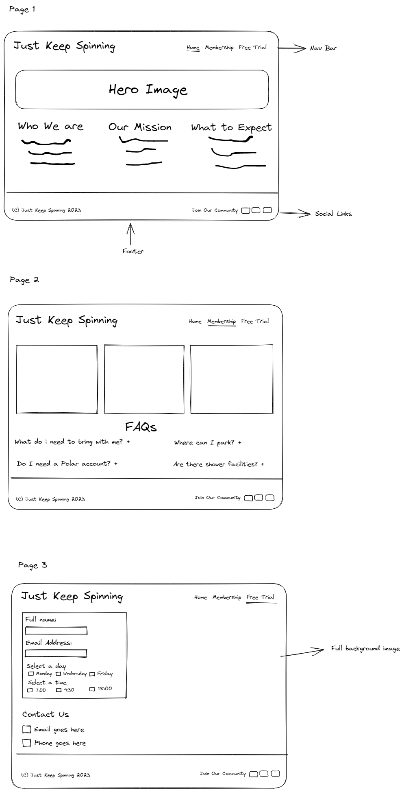
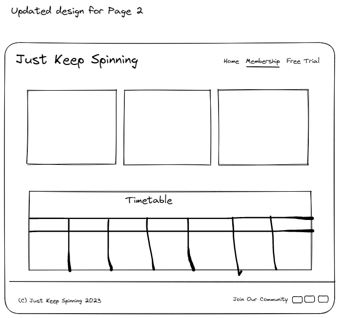
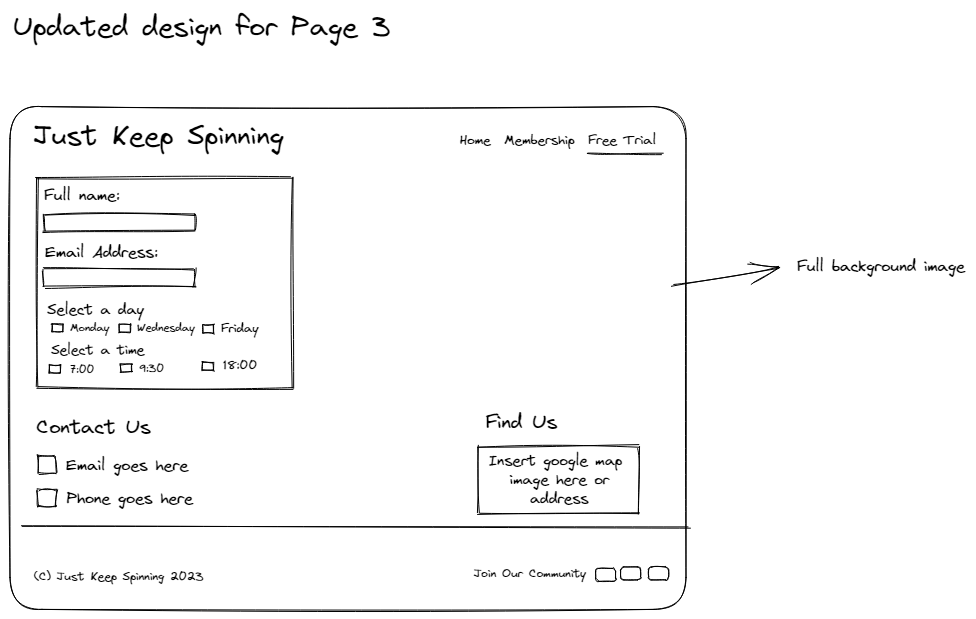

# Just Keep Spinning

Just Keep Spinning is a website promoting a Dublin based spin studio. This website is aimed at anyone that is over the age of 16 and is keen to keep fit improve their cardio fitness while having some fun. Just keep spinning offers a variety of membership options, one to suit everybody which potential members can view on the website. Potential members will have the opportunity to sign up for a free trial on the website, selecting a day & time that suits them best. Potential members will be able to view the timetable to make sure there is a class available at a time that suits them best.

## Features 

### Existing Features

* Navigation Bar

    * 

* Hero Image

    *

* Who We Are, Our Mission & What to Expect 

    *

* The Footer

    *

* Membership Prices 

    *

* Timetable 

    *

* Free Trial sign up form

    *

* Contact Us

    *

* Where to Find Us

    *

### Future Features

* An online booking system for members
* The option for members to purchase memberships on the website

## UX

### Site Goals

The goal of Just Keep Spinning is to inform potential members (users) of what we have to offer. We want users to be able to visit the site and find all the information they need. We want users to be able to find information quickly, so we have chosen a simple design and kept content to a minimum. We have kept the structure of each of the 3 pages the same with uniformed nav bar and footer and image placement so that each page looks familiar to the user.

### Design Choices

### User Stories

As a user:
    
* I want to see 3 pages on the website
* I want to see a hero image on the homepage
* I want to see the following 3 headings on the homepage with a paragraph of  text underneath each one
    * Who we are
        * Just Keep Spinning is a Dublin based studio focusing solely on spin classes. This family-owned business was started by siblings Carl and Claudia, both high preforming athletes with a passion for all things cardio.

    * Our Mission
        * Our aim is to build a community of people that share the same passion for improving their cardiovascular health while having fun, listening to the best music, and all while being part of a team all. We move as one.

    * What to Expect
        * Push yourself for 30 to 45 minutes depending on which class you choose. Each class will have a minimum of one instructor who will be on the bike for the whole class explaining each step and helping to push you even further.

* I want to see a footer which remains in place for each of the 3 pages
* I want to see a copyright message in the footer
* I want to see 'Join Our Community:' text in the footer followed by the Instagram, Twitter & Facebook icons
    * When each icon is clicked I should be directed to the respective website
    * The website should open in a new browser tab
* I want to see the 3 types of membership options on the Membership page
* I want to see the class timetable underneath the membership prices on the membership page
* I want to see a sign up form on the Free Trial page
    * The form heading should read 'SIGN UP FOR YOUR FREE TRIAL TODAY'
    * The form should include an input field for Full Name & Email Address
        *These should be required fields
    * The form should have a text instruction of 'Select a day that suits you best' with 3 checkboxes underneath the text
        * Checkboxes should be as follows Monday, Wednesday and Friday. 
        * The checkboxes should sit in front of each day
        * This is a required field
    * The form should have a text instruction of 'Select a time that suits you best' with 3 checkboxes underneath the text
        * Checkboxes should be as follows 7:00, 9:30 and 18:00. 
        * The checkboxes should sit in front of each option
        * This is a required field
    *There should be a 'Sign me up!' submit button
    * The form should be submitted once each of the required fields has been filled out
    * A confirmation message should appear on the screen if the form has been successfully submitted
* I want to see a contact us heading on the page
    * This should contain an email icon with email address  justkeepspinning@gmail.com
    * This should contain a telephone icon with phone number 01-8205544

### Wireframes

See inital wireframe which was created using [Excalidraw](https://excalidraw.com/) 

See updaed version for page 2 after i decided it was best to include a timetable of classes rather than the FAQ section.

See updated version for page 3 after I decided to include a Where to find us section

